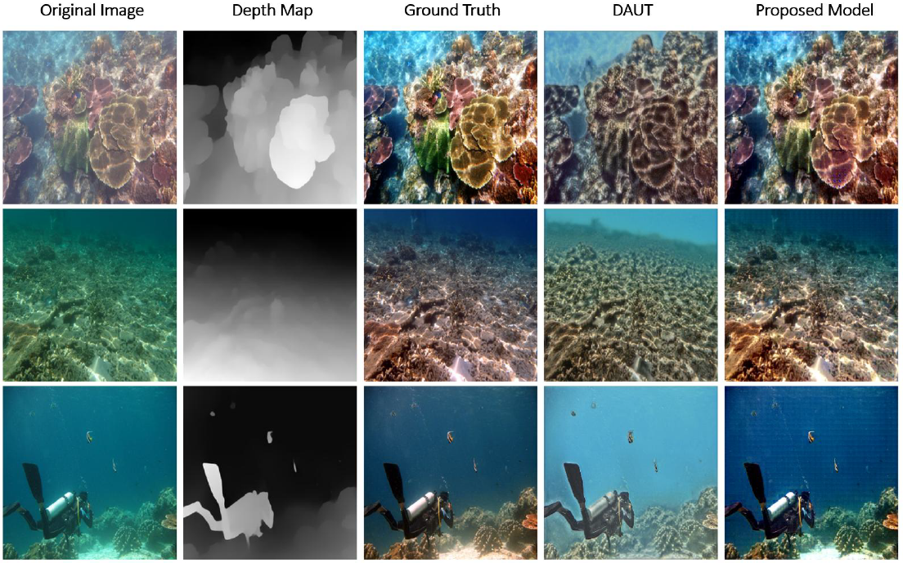
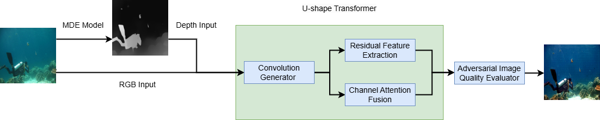

# Optimizing Depth-Aware U-Shape Transformers for Underwater Image Enhancement

<p align="center">
  
</p>

## 📌 Overview

This project proposes a novel enhancement to the [**Depth-Aware U-Shape Transformer (DAUT)**](https://github.com/MBadran2000/Depth-Aware-U-shape-Transformer) architecture to improve **underwater image enhancement** using **monocular depth estimation**, **channel attention**, and **histogram loss**.

Underwater imagery often suffers from severe visibility issues due to **color distortion**, **light scattering**, and **low contrast**. This work aims to restore natural color tones and details by integrating depth-awareness into the image enhancement pipeline.

---

## ✨ Key Contributions

- **Depth Normalization**: Rescales depth maps to `[0, 255]` to ensure consistent depth input.
- **Channel Attention Mechanism**: Reweights spectral features to restore colors like red/yellow.
- **Histogram Loss**: Preserves color distribution and avoids over-saturation.
- **4-Channel Input**: Combines RGB with normalized depth.
- **Transformer-Based Generator**: U-Shape architecture with residual and attention modules.
- **Adversarial Discriminator**: Enforces perceptual realism during training.

---

## 🧠 Model Architecture

<p align="center">
  
</p>

1. **Input Preparation**: RGB image + normalized depth from MiDaS or DPT-Hybrid → 4 channels.
2. **Feature Extraction**: Residual blocks + channel attention.
3. **Output Layer**: Generator output judged by discriminator for realism.

---

## 📊 Evaluation Metrics

| Metric | Description |
|--------|-------------|
| **PSNR** | Peak Signal-to-Noise Ratio – higher = less distortion |
| **SSIM** | Structural Similarity Index – higher = better detail retention |
| **UCIQE** | Underwater Color Image Quality – higher = better color and contrast |

---

## 📈 Results

| Model Variant | PSNR ↑ | SSIM ↑ | UCIQE ↑ |
|---------------|--------|--------|---------|
| DAUT (CycleGAN) | 22.39 | 0.81  | 0.7857  |
| **Proposed**    | **20.75** | **0.8330** | **0.7789** |

- **Improved clarity**, **reduced artifacts**, and **balanced colors**
- Outperforms or matches the baseline in multiple metrics

---

## 🧪 Dataset & Training

- **Dataset**: [UIEB]([https://www.kaggle.com/datasets/larjeck/uieb-dataset-reference]) (890 paired images)
- **Preprocessing**:
  - Resize to `256x256`
  - Generate depth with MiDaS v2.1 / DPT-Hybrid
  - Normalize to `[0, 255]`
- **Training**:
  - 300 epochs
  - Optimizer: Adam
  - Loss: L1 + Adversarial + Histogram

---

## 🔬 Future Work

- Extend to **real-time video enhancement**
- Enhance **depth prediction in murky waters**
- Add **self-supervised learning** for better generalization
- Integrate with **semantic segmentation** for marine robotics

---

## 🙋‍♀️ Author

**Golnoosh Asady**
Master’s Degree in Computer Science
Sapienza University of Rome

---

> *For academic or research use only. Please cite or acknowledge this repository in your work.*

```
